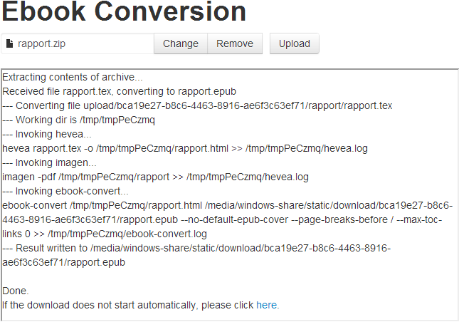

LaTeX to Ebook Converter
========================

tex2ebook.py is a converter for LaTeX documents to EPUB/Mobipocket.

webapp.py is a web interface for tex2ebook.py.

Requirements
------------

tex2ebook has so far only been tested on Unix. The following software is required to run it:

- [texlive](http://www.tug.org/texlive/)
- [ocaml](http://ocaml.org/)
- [hevea](http://hevea.inria.fr/)
- [imagemagick](http://www.imagemagick.org/)
- [calibre](http://calibre-ebook.com/)
- [Python 2](http://www.python.org/)
- [Flask](http://flask.pocoo.org/)

License
-------

Written by Matthias Lambert and Roman Zoller, released under [Apache License v2.0](http://www.apache.org/licenses/LICENSE-2.0).

The web interface contains compiled versions of
- [jQuery](https://jquery.org/), licensed under the [MIT License](https://jquery.org/license/)
- [Bootstrap with Jasny extensions](http://jasny.github.io/bootstrap/), licensed under [Apache License v2.0](http://www.apache.org/licenses/LICENSE-2.0)

Screenshot
----------
 

